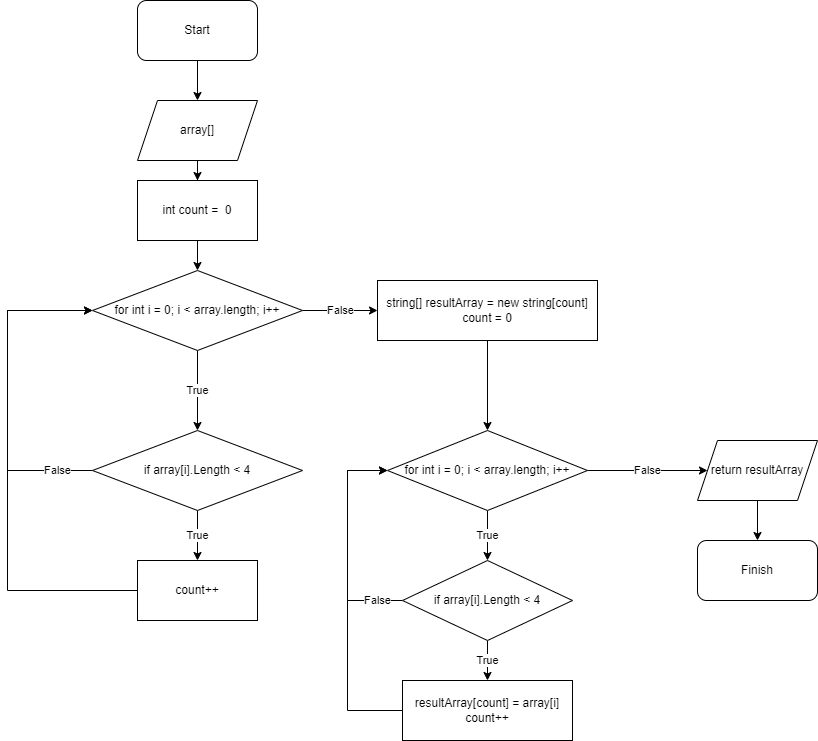

# Resume Work №1
## Задача

Создать программу которая из имеющегося массива строк *(Массив задается при создании или создается пользавателем при помощи специального метода)* формирует другой массив, заполненый строками первого массива длинна которых меньше или ровна 3-м символам.

## Принцип работы программы:

1. 
+ Создан метод который будет запрашивать у пользователя размерность массива
+ По очереди вводятся строки в массив
+ Возвращается заполненый массив.

2. 
+ Создан метод который на вход принимает массив. 
+ Создна переменная **count**. 
+ Создан цикл по переборке всего массива. 
+ В нем устанавливается условие что при нахождении в массиве строки длинной менее 4-х символов счетчик увеличивается на еденицу *(это нужно для того чтобы узнать сколько ячеек нам надо в результирующем массиве)*. 
+ Создан массив размерностью **count** и после обнуленно значение **count**. 
+ Повторно запускается цикл на перевор массива и так же добавленно условие что при нахождении строки менее 4-х символов эта строка добавляется в результирующий массив на позицию **count** и после увеличивается значение **count** на 1. 
+ Метод возвращает результирующий массив. 

3. 
+ Создан метод по выводу массива на экран *(если в массиве нет элементов выводится надпись "Массив пуст.")*.
 
4. 
+ Далее поочередно создаются соответствующие переменные и вызываются эти методы с передачей в них соответсвующих параметров.
